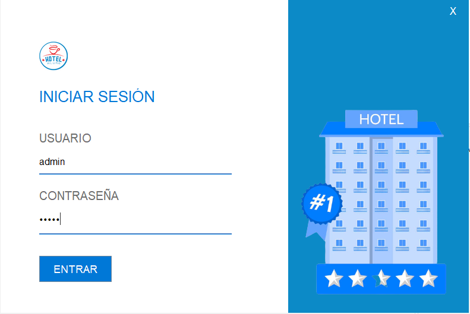
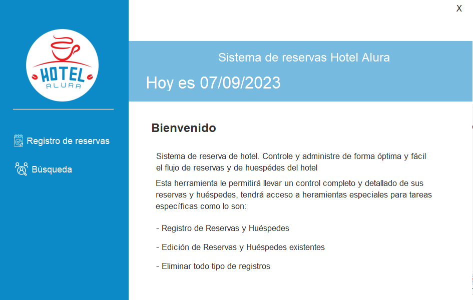
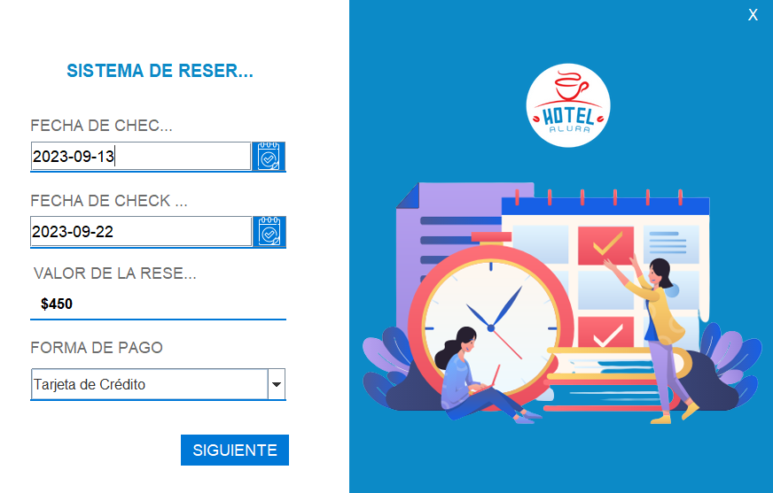
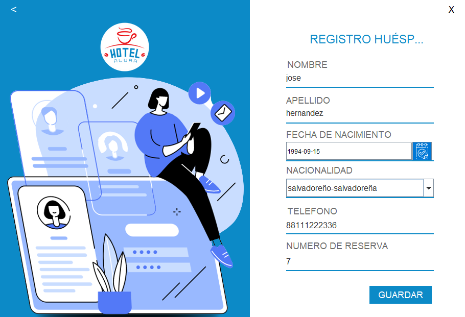
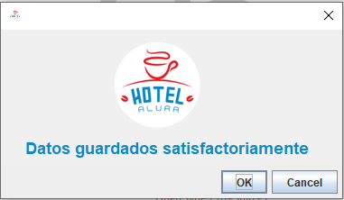
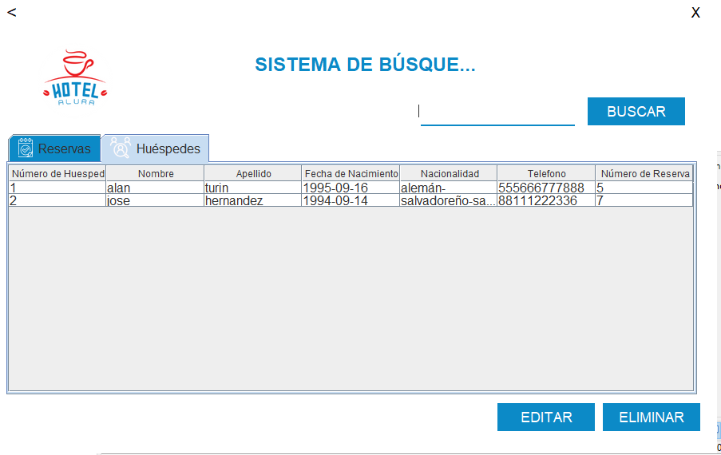

# hotel-alura-challenge
Proyecto realizado para completar el challenge Hotel Alura.

# APLICACION HOTEL ALURA

# TECNOLOGIAS USADAS

IntelliJ IDEA
MySQL Workbench

# ARCHIVOS JAR NECESARIOS

- c3p0-0-9.5.4
- jcalendar-1.4
- mchange-commons-java-0.2.16
- mysql-connector-java-8.0.17

# INICIO APP

# LOGIN

  
# PANTALLA PRINCIPAL

# RESERVAS

# REGISTRO HUESPEDES

# HUESPED REGISTRADO

# BUSQUEDA HUESPEDES

# BUSQUEDA RESEVAS

